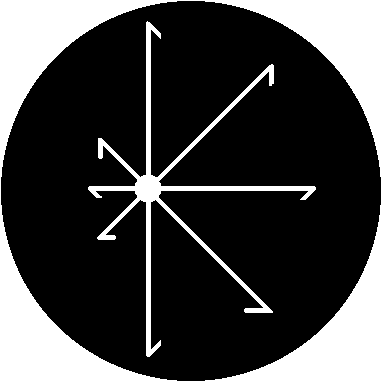

   
   <h2 align="center">¡Hi there👋! I'm Genesis G. Rosario</h2>
   <h4 align="center">⚛⚡🤖 Electronic Engineer - Embeded Software/Hardware Developer 🤖⚡⚛</h4>
   <h4 align="center">💻 IT Specialyst - Web/App Developer 💻</h4>

<!--
**ingGGRM/ingggrm** is a ✨ _special_ ✨ repository because its `README.md` (this file) appears on your GitHub profile.

Here are some ideas to get you started:

- 🔭 I’m currently working on ...
- 🌱 I’m currently learning ...
- 👯 I’m looking to collaborate on ...
- 🤔 I’m looking for help with ...
- 💬 Ask me about ...
- 📫 How to reach me: ...
- 😄 Pronouns: ...
- ⚡ Fun fact: ...
-->
